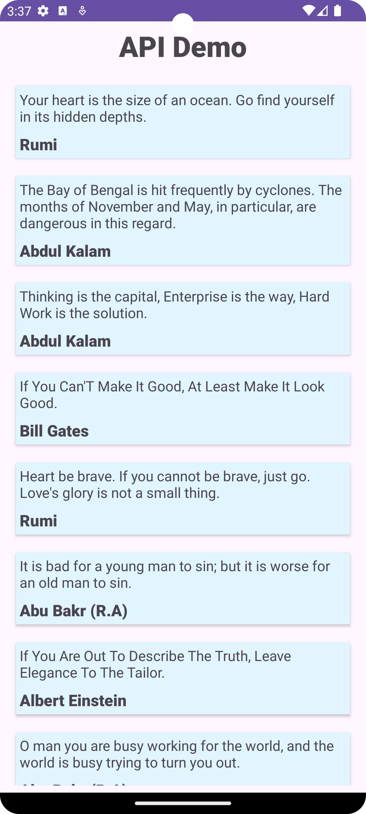
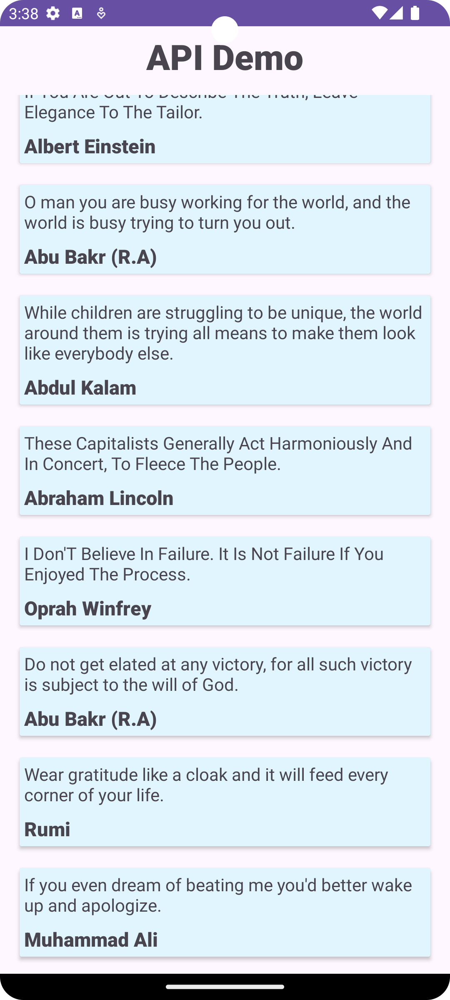

# API Demo App

This Android application demonstrates how to make API calls using Retrofit and display the data in a RecyclerView.

## Features

- Fetches data from a sample API using Retrofit.
- Displays quotes in a RecyclerView.

## Table of Contents

- [Getting Started](#getting-started)
  - [Prerequisites](#prerequisites)
  - [Installation](#installation)
- [Usage](#usage)
- [Libraries Used](#libraries-used)
- [Contributing](#contributing)
- [Acknowledgments](#acknowledgments)

## Getting Started

Follow these instructions to set up and run the project locally.

### Prerequisites

- Android Studio
- Internet connection (to fetch data from the API)

### Installation

1. Clone the repository to your local machine:

    ```bash
    git clone https://github.com/Kishanr000/Api-Demo-using-Retrofit.git
    ```

2. Open the project in Android Studio.

3. Build and run the application on an emulator or a physical device.

## Usage

1. Launch the app on your device.

2. The app will make an API call to fetch quotes and display them in a RecyclerView.

## Screenshots




## Libraries Used

- [Retrofit](https://github.com/square/retrofit)
- [Gson](https://github.com/google/gson)

## Contributing

If you'd like to contribute to this project, please follow the typical GitHub pull request process.

1. Fork the project.
2. Create a new branch.
3. Make your changes.
4. Submit a pull request.


## Acknowledgments

- Thanks to [Dummy JSON](https://dummyjson.com/) for providing a sample API.
